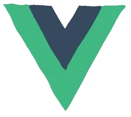

 
  
  

<!-- programming tool icon 编程工具图标 -->
<h3 align="center">Languages and Tools:</h3>

  

  

 
  

<!-- GitHub 数据统计 -->

  

<picture align="center" >
  <source
    media="(prefers-color-scheme: dark)"
    srcset="https://raw.githubusercontent.com/CIA0CIAO/CIA0CIAO/output/github-contribution-grid-snake-dark.svg"
  />
  <source
    media="(prefers-color-scheme: light)"
    srcset="https://raw.githubusercontent.com/CIA0CIAO/CIA0CIAO/output/github-contribution-grid-snake.svg"
  />
  
</picture>

   

